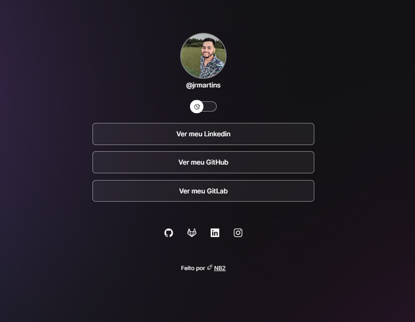

  

## 🚀 Tecnologias

Esse projeto foi desenvolvido com as seguintes tecnologias:

- HTML
- CSS
- JavaScript

## 💻 Projeto

Este projeto tem como finalidade treinar e colocar em prática as tecnlogias acima citadas. E agrupar os links de minhas redes socias e portifolio.